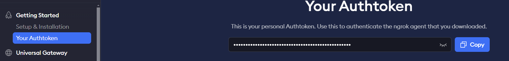

This guide explains how to upload and run a `.ipynb` file on Google Colab, including setting up secrets for your session.

## Steps to Follow

### 1. Upload the `.ipynb` File to Google Colab

- Open Google Colab.
- Upload the `.ipynb` file from your local machine or import it from your Google Drive.

### 2. Create and Add Colab Secrets

To interact securely with external services like Ngrok, you’ll need to set up secrets.

#### Steps to Set Up Ngrok:

1. Register for a free account on [Ngrok](https://ngrok.com).
2. Obtain your Ngrok authentication token from your Ngrok dashboard.
3. Add the token as a secret or configure it in your notebook to establish a secure tunnel.

#### Add the Token as a Secret in the Notebook
- Set the token in a secret notebook or configure it in your `.ipynb` file to establish a secure tunnel.

###  Run all code
- Execute all cells in the notebook.
- After running the code, you will see a link displayed under **"My Tunnel"**.
    - **Example:** `My tunnel = [Generated Link]`
- Click on the link to access the model interface.

### Result

